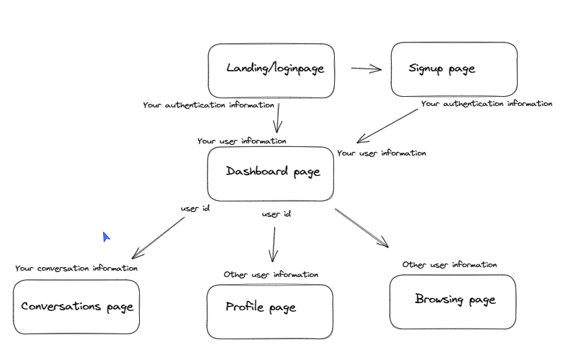
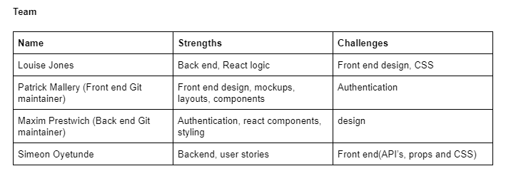

# Date-abase

## Overview

This is a project with a mission to connect nerds with their dream "programming" partners ;). users will be able to create and account and dating profile by answering a few important questions to determine your best match. You can browse other peoples profile and if you like the look of someone try matching with them and see if they reciprocate. If you end up lucky youll be able to chat.

## Planning

View Schema diagram here:

https://excalidraw.com/#room=9c9f4fc8e1279bd72d46,vo3AP7_F2bYc7GiY1E9DCQ

View wire frames here:

https://xd.adobe.com/view/4cc19f9e-36f6-404a-8564-083fd55380cd-1992/?fullscreen&hints=off

## User stories

MVP

- As a nerd I want to create an account so I can create a personalised experience
- As a nerd I want to create a bio so I can show potential partners what I’m like
- As a geek I want to edit my bio so I can keep it up to date
- As a dork I want to answer survey questions so that the website can match me with people that have similar interests.
- As a geek I want to specify my gender and which gender(s) I’m interested in so I only see partners who are mutually interested in each other
- As a dork I want to browse other nerds’ profiles so I can learn more about them
- As a geek I want to select my favourite dorks so I can express my interest in them
- As a geek I want to be notified when someone favourites me so I can see if we are interested in each other
- As a dork I want to be notified when I have favourited someone and they have favourited me, so I can know we are both interested in each other
- As a nerd I want to message geeks I have matched with so we can arrange a date
- As a nerd I would like the option to select or reject any profile I want

Beyond MVP

- As a nerd I want to upload a photo of myself so other nerds know what I look like
- As a dork I want to get some helpful (nerdy) chat up lines so I can break the ice with my date more easily
- As a geek I want to see only the dorks near me so I can meet them without travelling too far

## Timeline

- Thursday (Afternoon, design and scoping)
- Friday (All day)
- Saturday (No obligation but working allowed)
- Sunday (No obligation but working allowed)
- Monday (No obligation but working allowed)
- Tuesday (All day)
- Wednesday (All day, MVP due)
- Thursday (All day, refactoring)
- Monday (9am check ins and final changes, 10am project presentation)

## Group planning

Our Mission

- Connect nerds with thier dream "programming" partner ;)

Team Goals $ Values

- MVP first
- Agile working
- Open Communication
- Learning together

Team Communication Preferences

- Breakout rooms in pairs
- Slack messages at any time
- Lunchtime synchronised pulling and merging
- end of day review

Approach

- Backend first, break into 2 pairs and work on different parts of the backend (use Postman to verify
- Then change the pairings and repeat for the frontend
